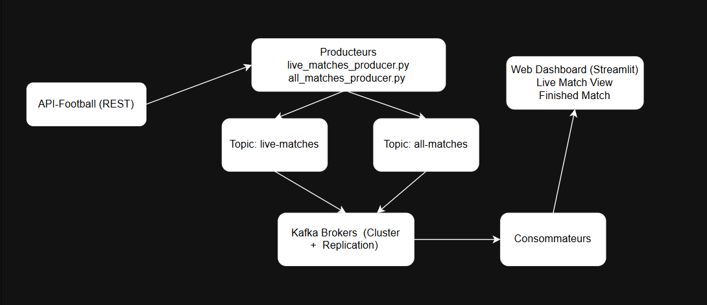
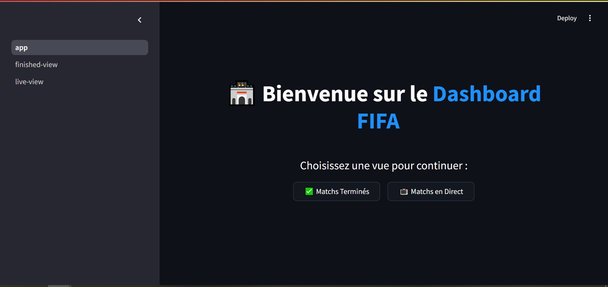
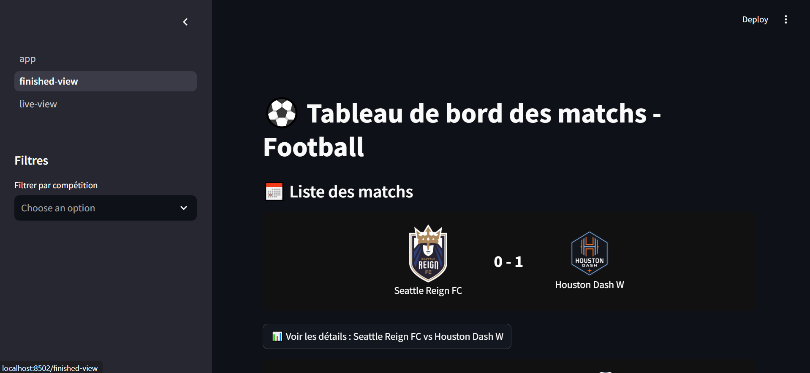
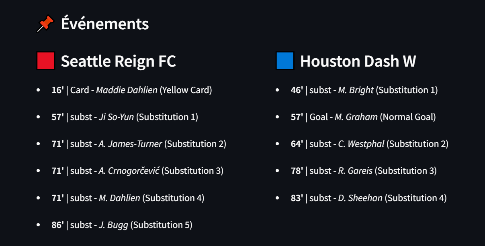
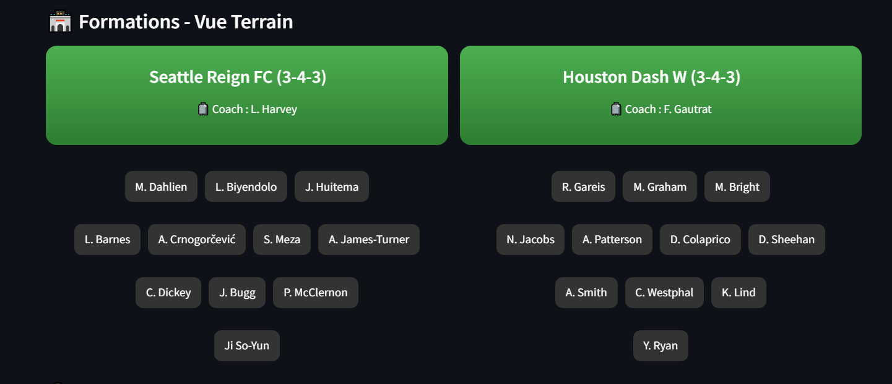
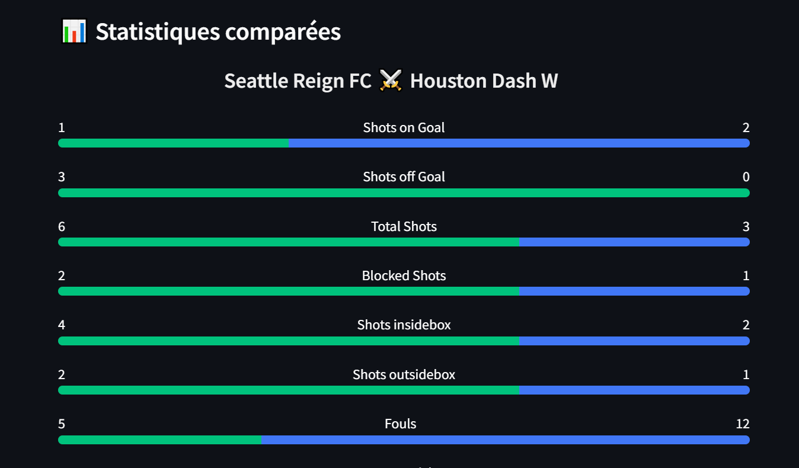
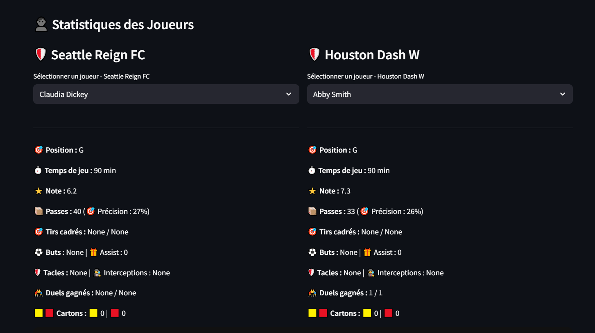
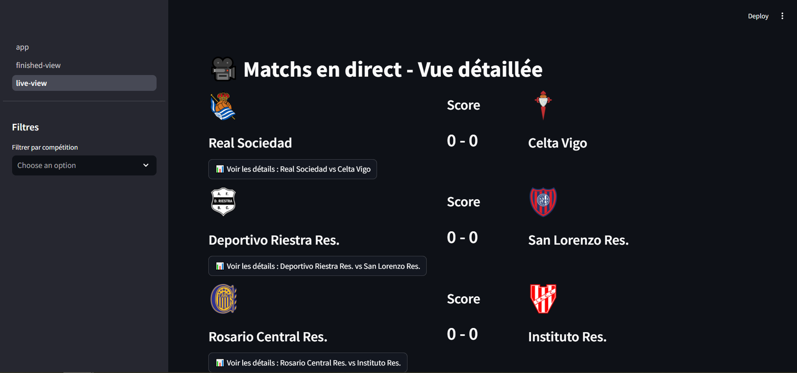

# ⚽ FIFA Kafka Streaming Project

This project fetches football match data using the [API-Football](https://www.api-football.com/) and streams it using **Apache Kafka**.  
It includes real-time and historical match producers, Kafka consumers that store the data, and a **Streamlit dashboard** for visualization.  
You can also store the data in **Neo4j** for graph-based analysis.

---

## 📦 Features

- Real-time data streaming using Kafka
- Producers for **live** and **finished** matches
- Consumers that save data as JSON files
- Streamlit dashboard with live and past match views
- Optional graph database storage with **Neo4j**

---

## 📁 Project Structure

```
fifa_kafka/
├── config/                 # Config files (optional)
├── producers/             # Kafka producer scripts
│   ├── live_matches_producer.py
│   └── all_matches_producer.py
├── consumers/             # Kafka consumer scripts
│   ├── live_matches_consumer.py
│   └── finished_matches_consumer.py
├── dashboard/             # (Optional) Streamlit dashboard
├── requirements.txt       # Dependencies
└── README.md              # This file
```

---

## ▶️ Getting Started

### 1. Install dependencies
```bash
pip install -r requirements.txt
```

### 2. Start Kafka and ZooKeeper

Start the services locally or via Docker. Example using local setup:

```bash
zookeeper-server-start.sh config/zookeeper.properties
kafka-server-start.sh config/server.properties
```

> Make sure Kafka is running on `localhost:9092`

---

### 3. Run the Producers

#### Live Match Producer
```bash
python producers/live_matches_producer.py
```

#### Finished Match Producer
```bash
python producers/all_matches_producer.py
```

---

### 4. Run the Consumers

```bash
python consumers/live_matches_consumer.py
python consumers/finished_matches_consumer.py
```

This saves data to `live_matches_data.json` and `finished_matches_data.json`.

---

### 5. Run the Streamlit Dashboard (optional)

```bash
streamlit run dashboard/dashboard.py
```

Use the sidebar to switch between live and finished matches.

---

## 🔐 API Key Configuration

Create a `.env` file at the root with:
```
API_KEY=your_api_key_here
```

Or add it directly inside the producer script headers.

---

## 🧠 Neo4j Integration (Optional)

You can parse your JSON and create nodes and relationships in Neo4j using:

- `(:Match)`
- `(:Team)`
- `(:Event)`
- `(:Player)`
- and relationships like `HAS_EVENT`, `HAS_HOME_TEAM`, `BY_PLAYER`, etc.

Example Cypher query:
```cypher
MATCH (t:Team)<-[:FOR_TEAM]-(:Event)<-[:HAS_EVENT]-(m:Match)
RETURN t.name, count(*) AS goals
```

---

## 📸 Screenshots

### 🧩 Architecture du système


---

### 🏁 Accueil du Dashboard


---

### ✅ Vue des matchs terminés


---

### 🔴 Événements du match


---

### 🧠 Formations - Vue Terrain


---

### 📊 Statistiques comparées


---

### 👤 Statistiques des joueurs


---

### 🎥 Vue détaillée des matchs en direct


---

## 📜 License

MIT License – Free to use and modify.

---

## 🙋 Author

Developed by **Soulaimane Ait Ahmed Oulhaj** – Master AIDC @ FST Béni Mellal
